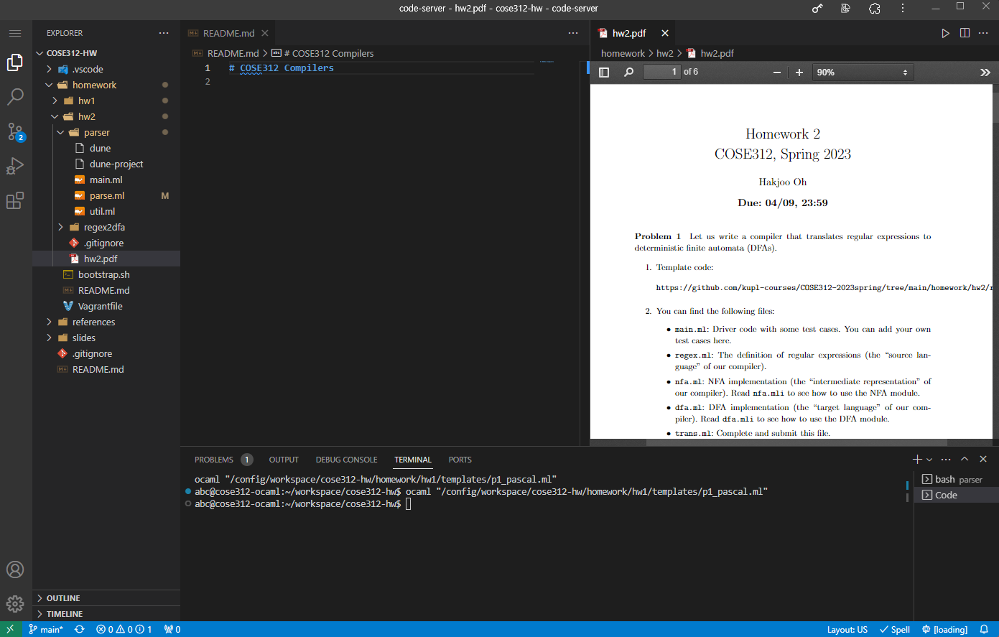

기본으로 주어진 vagrant도 좋은 솔루션이지만 가상머신 설치해야하는 불편함이 있어 도커로 사용할 수 있는 환경을 구축했습니다.

외부에서 접근 가능한 서버에 컨테이너를 구동하는 것을 상정하고 작성했습니다.

컨테이너의 이미지는 vscode를 웹 IDE로 사용할 수 있는 `code-server` 프로그램의 도커 포팅 버전 중 `linuxserver/code-server`를 사용하였습니다.

ocaml 및 관련 설정으로 인하여 컨테이너의 첫 구동 시간이 오래 걸릴 수 있습니다. 내부 볼륨이 삭제되지 않는 한 재시작할 때에는 비교적 빠른 시간 내에 컨테이너가 부팅됩니다.

필요한 것으로 보이는 vscode 익스텐션은 자동으로 설치되도록 구성하였습니다.

컨테이너 내의 쉘은 `bash`를 사용하는 것으로 스크립트가 작성되어 있습니다. 그리고 사용자명이나 UID 등은 `linuxserver/code-server`이미지에서 제공하는 기본 값으로 고정했습니다. 

`bootstrap.sh` 스크립트의 headless 실행을 위하여 `sudo` 요청 시 패스워드 입력을 비활성화했습니다.



# Setup

1. install docker, docker-compose

2. make directory to store files

vscode 파일과 프로젝트 파일이 저장될 폴더를 생성합니다.


3. copy files

`99-setup`, `bootstrap.sh`를 호스트의 적절한 폴더에 복사합니다.

```
예시

/code-server-ocaml
  | - docker-compose.yml
  | - /settings
       | - 99-setup
       | - bootstrap.sh
  | - /workspace
```

폴더 구성에 따라 `docker-compose.yml`의 `volumns`항목은 수정되어야 합니다!


4. edit files

개인 설정에 맞게 `docker-compose.yml`파일을 수정합니다.

기본 설치된 익스텐션 목록
- analytic-signal.preview-pdf
vscode에서 pdf를 볼 수 있습니다.

- freebroccolo.reasonml
ocaml 하이라이트 및 linter

- ocamllabs.ocaml-platform|
공식 ocaml 익스텐션

- esbenp.prettier-vscode
prettier

- ms-python.python
python extension bundle

- streetsidesoftware.code-spell-checker
code spell checker

- formulahendry.code-runner
적절히 설정되어 있다면 `ctrl + alt + n`으로 열린 코드를 실행할 수 있습니다.

- vscode-icons-team.vscode-icons
파일브라우저에서 더 나은 아이콘 경험

- naumovs.color-highlight
색상코드 하이라이트

5. deploy

```
/code-server-ocaml
  | - docker-compose.yml
  | - /settings
       | - 99-setup
       | - bootstrap.sh
  | - /workspace
```

위와 같은 폴더 구조를 구성했다면 

`/code-server-ocaml`로 이동한 뒤 `docker compose up -d` 명령어를 통하여 컨테이너를 실행합니다.


6. access

웹 브라우저를 통하여 `localhost:8443`에 접속하면 VSCode와 유사한 환경으로 코딩할 수 있습니다.

`bash` 터미널을 이용하여 아래 명령어를 수행하면 깃허브 내용을 가져올 수 있습니다.
```bash
git clone https://github.com/kupl-courses/COSE312-2023spring.git
```


